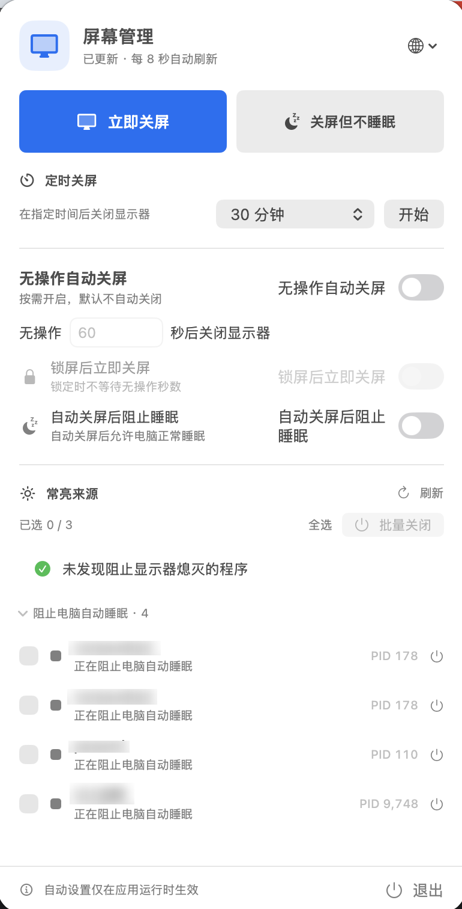
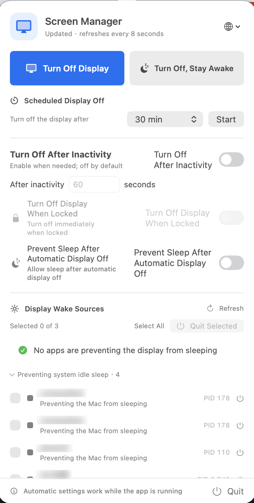

# 屏幕管理 | Screen Manager for macOS

[简体中文](README.md) · [English](README_EN.md)

macOS 菜单栏工具：查看哪些进程阻止显示器熄灭或电脑自动睡眠，并可立即关屏、定时关屏，或在关屏时保持电脑运行。

<div align="center">
  
  &nbsp;&nbsp;
  
</div>
<p align="center"><sub>简体中文 · English</sub></p>

## 安装

下载并打开 [屏幕管理 DMG](build/屏幕管理.dmg)，将“屏幕管理”拖到镜像中的 **Applications** 图标。打开应用后，可从菜单栏的显示器图标进入主界面。

旧版或 Actions 普通构建产物尚未经过 Developer ID 签名和 Apple 公证。若 macOS 提示应用已损坏，可在“应用程序”中对“屏幕管理”点右键并选择“打开”；仍无法打开时，在终端运行 `xattr -dr com.apple.quarantine "/Applications/屏幕管理.app"` 后再启动。正式 GitHub Release 需完成仓库签名 Secrets 配置，之后发布的 DMG 会由 Apple 公证。

## 功能

- **查看唤醒来源**：每 8 秒读取 macOS 电源断言，分别列出阻止显示器熄灭和阻止电脑空闲睡眠的进程，并显示 PID 和断言用途。
- **管理进程**：勾选并批量退出进程；右键可查看 PID、断言、程序路径等信息，或在访达中显示程序。强制结束前会要求确认。
- **关闭显示器**：可立即关屏，或设置 1 分钟至 2 小时的定时关屏。
- **关屏并保持运行**：手动关屏时可阻止电脑因空闲进入睡眠；也可单独开启“自动关屏后阻止睡眠”，应用于无操作、锁屏和定时关屏。可随时恢复自动睡眠。
- **自动关屏**：无操作自动关屏默认关闭，开启后可设置 10 至 86,400 秒；锁屏后立即关屏选项由无操作自动关屏主开关控制。
- **自动隐藏**：点击其他应用时，主界面和进程信息窗口会隐藏。
- **中英文界面**：默认匹配 macOS 首选语言；点击主界面右上角地球图标，可切换“跟随系统”“简体中文”或“English”。选择会保存并立即生效。暂未支持的系统语言回退到英文。

## 使用说明

- 显示器关闭通过 macOS `pmset displaysleepnow` 请求；键盘、鼠标或触控板活动可唤醒显示器。
- 防睡眠功能使用 `NoIdleSleepAssertion`，允许显示器熄灭并阻止因空闲睡眠。macOS 仍可能因低电量、过热等强制原因让电脑睡眠。
- 锁屏和无操作自动关屏仅在应用运行时生效。退出应用会结束计时并释放本应用创建的防睡眠断言。
- 本工具读取的是 macOS 注册的电源断言。由模拟输入或系统显示器设置造成的常亮，未必会出现在列表中。

## 交流

欢迎通过微信交流使用体验和功能建议。微信二维码：。

## 从源码构建

需要 macOS 13 或更新版本，以及 Xcode Command Line Tools。

```sh
./build_app.sh
./build_dmg.sh
```

应用和 DMG 分别生成在 `build/屏幕管理.app` 与 `build/屏幕管理.dmg`。DMG 打包脚本会添加 **Applications** 快捷方式并校验镜像。应用图标由 `Scripts/generate_app_icon.swift` 绘制；中英文界面资源位于 `Resources/en.lproj` 和 `Resources/zh-Hans.lproj`。
